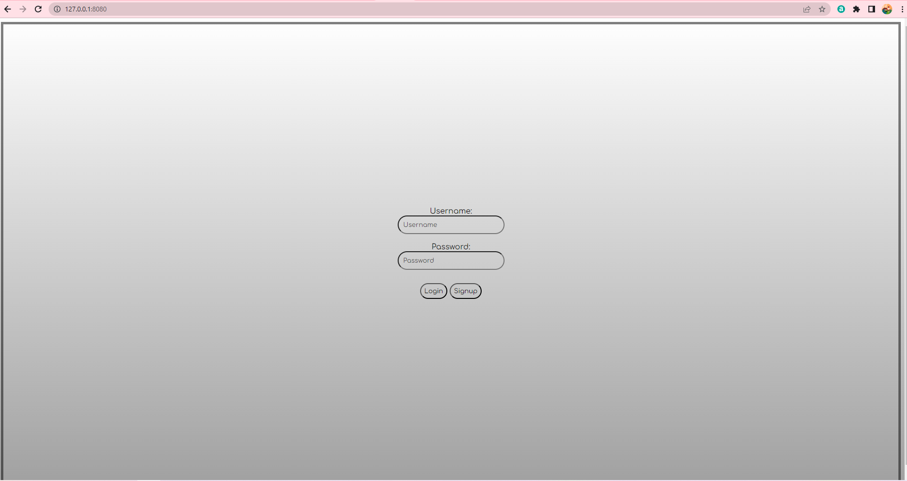

# cse3310_su23_group_3
The various requirements we did for the client side as a group started with first implementing a unique client ID every time a client connects to the server. Then allowing the client side to obtain a list of currently connected clients. The client has a chat box with a send button, and the client shows a list of connected clients and upon selection of that client it will display that user. For the server side, we ensured that the server would handle multiple client events for private messaging between users. The backend work that we did was making use of a logger in order to pipe all console messages to a file called “log.txt”, also formatting it into a JSON. It also includes a Login and sign-up function that when the user clicks on the login, it shall prompt a username and password that will be checked in a “users.txt” file in order to check if they have an account. When the sign-up is clicked it will take the user to create a username and password which is then stored in the “users.txt”. Overall, we updated the design of the webchat and added a background, borders, colors, and bubbles in order to make it aesthetically pleasing to look at for the user.

The system now when connected will first prompt the user to either login or sign-up, after a selection is made it will take them to the main webpage that shows a “type your message bubble”, a send, a to, and the message feed as well. When “To” is selected the user can select which client to choose from a list of users that are connected to the server. After the user has selected another user, the user can type a message and using the send button send them a message. On the top left corner, the user can select which group chat to join and can send messages to all users that are connected to the server.
The struggles we faced along the way were implementing the group chat functionality, the difficulty of it dealing with its handler, and HTML design as well. Another struggle we faced was implementing the login function, we were not able to get it working properly neither the sign-in was working properly. The script needs to be looked at along with working around the handlers.

In conclusion, we were able to merge our branches successfully, with a couple of errors that have been left unresolved. Our goal is to be able in the next iteration successfully finalize our requirements and add more functionality to them. We each earned our own experience working on different tasks whether it be client, server, backend, or frontend. This iteration also showed our ability to work as a team in order to solve each other's problems whether it be the backend or client side. We hope that by the next iteration, we will be able to solve the problems that were left in this iteration and be able to add more requirements in the future.

See below for our Design Documentation & Requirements Spreadsheet

